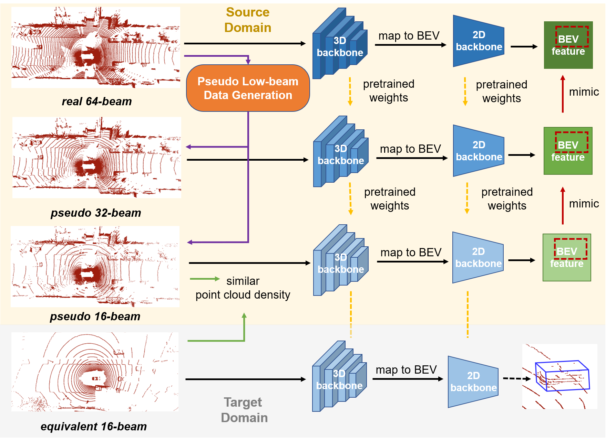

# LiDAR Distillation
### [Paper](https://arxiv.org/abs/2203.14956) | [Model](https://cloud.tsinghua.edu.cn/d/8c4541693833471e8b13/)
<br/>

> LiDAR Distillation: Bridging the Beam-Induced Domain Gap for 3D Object Detection  
> [Yi Wei](https://weiyithu.github.io/), Zibu Wei, [Yongming Rao](https://raoyongming.github.io/), [Jiaxin Li](https://www.jiaxinli.me), [Jiwen Lu](http://ivg.au.tsinghua.edu.cn/Jiwen_Lu/), [Jie Zhou](https://scholar.google.com/citations?user=6a79aPwAAAAJ&hl=en&authuser=1)  

<p align='center'>

</p>


## Introduction

In this paper, we propose the LiDAR Distillation to bridge the domain gap induced by different LiDAR beams for 3D object detection. In many real-world applications, the LiDAR points used by mass-produced robots and vehicles usually have fewer beams than that in large-scale public datasets. Moreover, as the LiDARs are upgraded
to other product models with different beam amount, it becomes challenging to utilize the labeled data captured by previous versions’ high-resolution sensors. Despite the recent progress on domain adaptive 3D
detection, most methods struggle to eliminate the beam-induced domain gap. 

## Model Zoo

### Cross-dataset Adaptation

| model     | method | AP_BEV | AP_3D |  
|------------|----------:|:-------:|:-------:|
| SECOND-IoU | Direct transfer | 32.91  | 17.24 | 
| SECOND-IoU | ST3D | 35.92 | 20.19 | 
| [SECOND-IoU](https://cloud.tsinghua.edu.cn/f/5a1f958ce2d84e81823b/?dl=1) | Ours | 40.66 | 22.86 | 
| [SECOND-IoU](https://cloud.tsinghua.edu.cn/f/a3dd295ac1824d19abf8/?dl=1) | Ours (w / ST3D) | 42.04 | 24.50 |
| PV-RCNN | Direct transfer | 34.50 | 21.47 | 
| PV-RCNN | ST3D | 36.42 | 22.99 | 
| [PV-RCNN](https://cloud.tsinghua.edu.cn/f/1cea8483c9494df5b46f/?dl=1) | Ours | 43.31 | 25.63 | 
| [PV-RCNN](https://cloud.tsinghua.edu.cn/f/3fa7c39d269e4425b4e3/?dl=1) | Ours (w / ST3D) | 44.08 | 26.37 |
| PointPillar | Direct transfer | 27.8 | 12.1 | 
| PointPillar | ST3D | 30.6 | 15.6 | 
| [PointPillar](https://cloud.tsinghua.edu.cn/f/d919a97bb66d467498d6/?dl=1) | Ours | 40.23 | 19.12| 
| [PointPillar](https://cloud.tsinghua.edu.cn/f/8466efb0c91c4d4caeb0/?dl=1) | Ours (w / ST3D) | 40.83 | 20.97 |

Results of cross-dataset adaptation from Waymo to nuScenes. The training Waymo data used in our work is version 1.0.

### Single-dataset Adaptation

|  beams  | method | AP_BEV | AP_3D |  
|------------------|----------:|:-------:|:-------:|
| 32 | Direct transfer | 79.81 | 65.91 | 
| 32 | ST3D | 71.29 | 57.57 | 
| [32](https://cloud.tsinghua.edu.cn/f/2664ab0e209348a1b5c2/?dl=1) | Ours | 82.22 | 70.15 | 
| 32* | Direct transfer | 73.56  | 57.77 | 
| 32* | ST3D | 67.08 | 53.30 | 
| [32*](https://cloud.tsinghua.edu.cn/f/be087fb6b9634a3c98fe/?dl=1) | Ours | 79.47 | 66.96 | 
| 16 | Direct transfer | 64.91  | 47.48 | 
| 16 | ST3D | 57.58 | 42.40 | 
| [16](https://cloud.tsinghua.edu.cn/f/d8888921ff2a48c9a381/?dl=1) | Ours |  74.32 |  59.87 | 
| 16* | Direct transfer |  56.32  | 38.75 | 
| 16* | ST3D | 55.63 | 37.02 | 
| [16*](https://cloud.tsinghua.edu.cn/f/21d8708a9c464945be61/?dl=1) | Ours | 70.43 | 55.24 | 

Results of single-dataset adaptation on KITTI dataset with PointPillars (moderate difficulty). For SECOND-IoU and PV-RCNN, we find that it is easy to raise cuda error on low-beam data, which is may caused by the bug in spconv. Thus, we do not provide the model but you can still run these experiments with the [yamls](tools/cfgs/kitti_models).


## Installation

Please refer to [INSTALL.md](docs/INSTALL.md).

## Getting Started

Please refer to [GETTING_STARTED.md](docs/GETTING_STARTED.md).

## License

Our code is released under the Apache 2.0 license.

## Acknowledgement

Our code is heavily based on [OpenPCDet v0.2](https://github.com/open-mmlab/OpenPCDet/tree/v0.2.0) and [ST3D](https://github.com/CVMI-Lab/ST3D). Thanks OpenPCDet Development Team for their awesome codebase.

## Citation

If you find this project useful in your research, please consider cite:
```
@article{wei2022lidar,
  title={LiDAR Distillation: Bridging the Beam-Induced Domain Gap for 3D Object Detection},
  author={Wei, Yi and Wei, Zibu and Rao, Yongming and Li, Jiaxin and Zhou, Jie and Lu, Jiwen},
  journal={arXiv preprint arXiv:2203.14956},
  year={2022}
}
```
```
@misc{openpcdet2020,
    title={OpenPCDet: An Open-source Toolbox for 3D Object Detection from Point Clouds},
    author={OpenPCDet Development Team},
    howpublished = {\url{https://github.com/open-mmlab/OpenPCDet}},
    year={2020}
}
```
